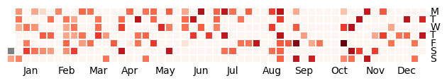

# Calmap-Visualize-MyTraining

- Calmap使って自分のトレーニングのログをgithubの草っぽくするレポジトリ

## 使い方

- 筋トレ用（9月から10月までを作成）

```
python src/main.py --data ./data/power-training.csv --single --output power-training.png
```


- ジョギング用（1月から10月までを作成）

```
python src/main.py --data ./data/jogging.csv --output jogging.png
```

