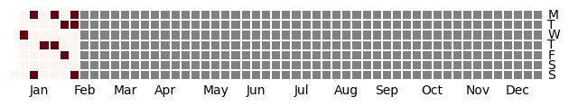
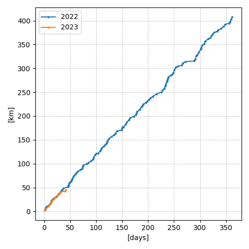

# Calmap-Visualize-MyTraining

- Calmap使って自分のトレーニングのログをgithubの草っぽくするレポジトリ

## 使い方

- 筋トレ用

```
python src/main.py --data ./data/power-training.csv --single --output output/power-training.png
```





- ジョギング用

```
python src/main.py --data ./data/jogging.csv --output output/jogging.png
```


- 山登り（累積和）

